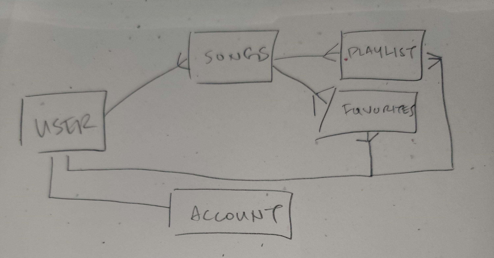
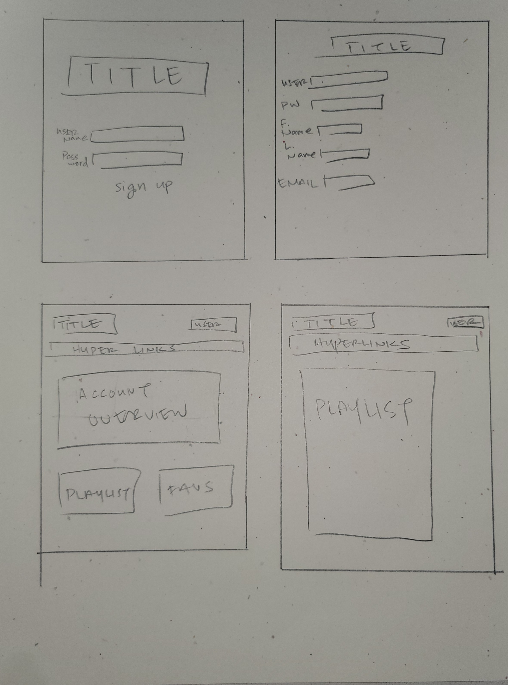
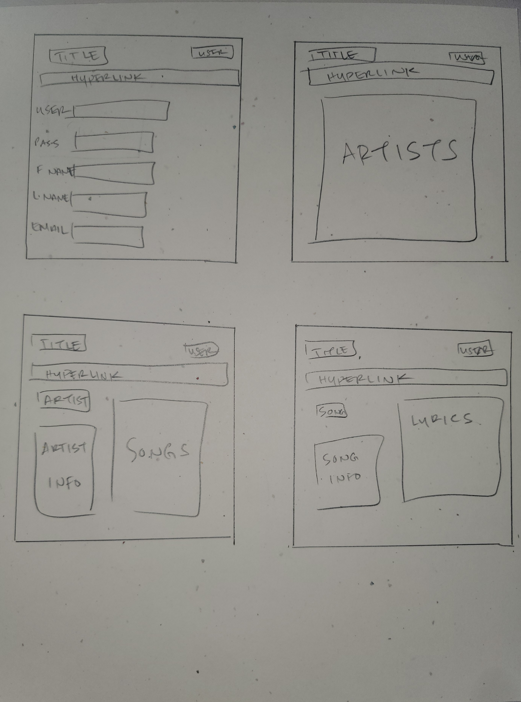

# project-2
Elevator Pitch :
A music app where a user can find songs, look up their lyrics, like and favorite them, add them to their playlist.

## Install Instructions

Fork and clone this repository
 - Install dependencies needed: npm i
 - bcryptjs
 - connect-mongo
 - dotenv
 - express
 - express-session
 - liquid-express-views
 - method-override
 - mongoose
 - morgan
 - node-fetch
  
Prepare the local host server
 - Create a .env file in the root folder
 - inside .env
   - set PORT=3000
   - if developing the app locally
     - set the DATABASE_URI
   - if developing online
     - set MONGODB_URI

Seed Database
 - For local run npm run seed
 - For heeroku
   - Inside terminal, heroku run bash
     - node bin/seed.js

User Stories
As a user:
 1. Create an account with username and password to use app.
 2. Log in to account with username and password to use app.
 3. View multiple pages such homepage, favorites page, playlist page.
 4. Be able to add a song to your playlist
 5. Be able to favorite a song
 6. Be able to remove song from playlist
 7. be able to remove song from favorites
 8. Be able to rate a song?
 9. Be able to favorite a artist?
 10. Rate an artist / song
 11. like an artist / song

API
Looking to use either spotify api https://developer.spotify.com/ , napster api https://developer.prod.napster.com/ , or create seeded list

Models
 1. User
 2. Artist
 3. Song
 4. Playlist?
 5. Favorites List?

 ERD
  

Route Table
 -------
 Name | Path | HTTP | Purpose
 | ---- | :----: |  :----: | ----------: |
 Index | /songtunes | GET | Displays a front page with create account, login
 New | /songtunes/new | GET | Display a account creation page
 Create | /songtunes | POST | Adds an account to the app
 Show | /songtunes/:id | GET | Display accounts page
 Edit | /songtunes/:id/edit | GET | Display edit page to edit account info
 Update | /songtunes/:id | PUT | Updates account info
 | ---- | :----: |  :----: | ----------: |
 Index | /songtunes/artists | GET | Displays a page with every artist
 Index | /songtunes/songs | GET | Displays a page with every song
 Index | /songtunes/artist | GET | Displays a page with specific artist and their songs
 Index | /songtunes/song | GET | Displays a page with specific song
 Index | /songtunes/genres | GET | Displays a page with list of song genres
 Index | /songtunes/genre | GET | Displays a list of songs from a specific genre
 | ---- | :----: |  :----: | ----------: |
 Index | /songtunes/:id/playlist | GET | Displays playlist page
 

 Wireframes

 
 

